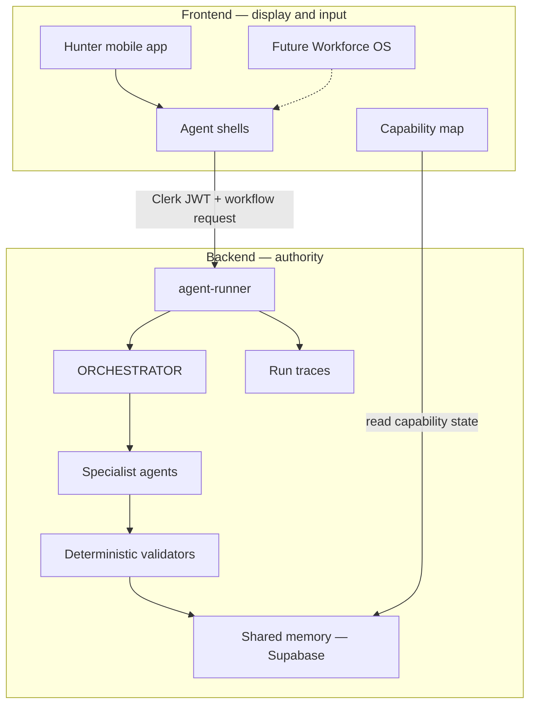

# Agent Platform Architecture Design

**Date:** 2026-08-01  
**Status:** Approved design; pending written-spec review  
**Strategy:** Supabase-native, platform-first  
**First tenant:** Project Hunter SYSTEM  
**Future tenant:** Workforce OS

## 1. Purpose

Build a reusable Agent Platform before expanding Project Hunter or creating a
general AI-workforce product. Project Hunter is the first production tenant and
proves the platform through its existing ORCHESTRATOR and ANALYZE agents.

The platform borrows useful ideas from compound-agent architectures and
SkillTree-style products without depending on SkillTree:

- one shared second brain;
- explicit agent capabilities and unlocks;
- a visible capability map;
- one orchestrator through which specialist agents report;
- runnable workflows rather than isolated prompts;
- deterministic validation before authoritative writes;
- observable runs that can resume safely.

## 2. Scope

### Initial implementation

1. Shared Agent Platform contracts.
2. A single `agent-runner` entry point.
3. `initialize` and `analyze` workflows.
4. ORCHESTRATOR and ANALYZE as nodes behind the runner.
5. Shared-memory repository interfaces.
6. Agent run and step observability.
7. A unified mobile runner client.
8. Uppercase onboarding questions.
9. Compatibility wrappers for the existing edge-function endpoints.
10. Local browser verification of the Hunter journey.

### Deferred

- LOG and EVALUATE workflows;
- MISSION, RANK, PENALTY, TRAIN, DIET and ADVICE implementations;
- Workforce OS frontend;
- vector search and embeddings;
- autonomous self-improvement;
- LLM-generated authoritative progression;
- Telegram or WhatsApp communication.

## 3. Platform Shape

The frontend collects input and presents state. The backend owns identity,
routing, validation, memory, progression and verdict authority.



### Frontend responsibilities

- collect user input;
- submit typed workflow requests;
- present progress, verdicts and capability states;
- cache display state temporarily;
- recover or retry an existing run.

The frontend must not calculate XP, rank, destiny, targets or unlocks. It must
not author authoritative SYSTEM verdicts.

### Backend responsibilities

- verify Clerk identity;
- resolve the tenant and actor server-side;
- route workflows;
- load shared context;
- execute agents in the required order;
- validate outputs;
- apply idempotent database writes;
- record run traces;
- return one typed response.

## 4. Backend Harness

### 4.1 Agent runner

`agent-runner` is the single public workflow entry point. Requests contain a
workflow identifier, version, payload and optional idempotency key. Tenant and
user identity are derived from the verified Clerk session.

Initial workflow identifiers:

- `hunter.initialize.v1`
- `hunter.analyze.v1`

The runner:

1. verifies authentication;
2. validates the request schema;
3. creates or resumes an agent run;
4. calls ORCHESTRATOR;
5. records every node transition;
6. returns progress or the final typed response.

### 4.2 ORCHESTRATOR

ORCHESTRATOR is a control-plane node, not an unrestricted chatbot. It:

- selects the workflow graph;
- loads the necessary memory;
- invokes specialist agents;
- checks that required outputs exist;
- routes outputs through deterministic validators;
- merges the final response;
- manages capability unlock state.

It does not perform UI work or bypass specialist ownership.

### 4.3 ANALYZE

ANALYZE remains the authority for:

- BMI, BMR, TDEE, body-fat estimate, lean mass and FFMI;
- calorie and protein targets;
- personal ascension path;
- personal S-Rank definition;
- initial E/D/C rank;
- progress snapshots and weekly recalibration.

Its numerical and progression-affecting output remains deterministic. A future
LLM may parse nuanced goals or improve explanatory copy, but its output cannot
directly change rank or progression.

### 4.4 Compatibility migration

Existing endpoints remain temporarily:

- `system-initialize` delegates to `hunter.initialize.v1`;
- `analyze-hunter` delegates to `hunter.analyze.v1`.

The mobile app migrates to the runner before these wrappers are removed.

## 5. Shared Memory

Agents depend on repository contracts rather than physical table names. Table
names may change without changing agent logic.

Logical repositories:

- `IdentityRepository`
- `ProfileRepository`
- `GoalRepository`
- `AnalysisRepository`
- `ProgressionRepository`
- `MemoryRepository`
- `AgentRegistryRepository`
- `AgentRunRepository`

Repositories are created from a verified `ExecutionContext` containing the
server-derived tenant and actor. Callers cannot override that scope.

Examples:

```ts
interface ExecutionContext {
  tenantId: string;
  actorId: string;
  runId: string;
}

interface ProfileRepository {
  getProfile(): Promise<Profile | null>;
  saveProfile(patch: ProfilePatch): Promise<Profile>;
}

interface MemoryRepository {
  search(input: MemoryQuery): Promise<MemoryRecord[]>;
  append(input: NewMemoryRecord): Promise<MemoryRecord>;
}
```

A memory record includes:

- tenant and actor;
- source agent;
- memory type;
- structured content;
- confidence;
- supporting references;
- creation and expiry timestamps;
- visibility classification.

Existing Hunter tables can remain initially. Repository adapters isolate those
names from the agent nodes.

## 6. Observability and Checkpoints

Every execution receives a stable `run_id`. The platform records:

- workflow ID and version;
- tenant and actor;
- status;
- idempotency key;
- start and finish times;
- current checkpoint;
- input and output summaries;
- error category;
- retry count;
- model usage and cost when applicable.

Each step records:

- agent/node ID;
- sequence number;
- status and duration;
- sanitized input/output summaries;
- deterministic validation result;
- retry and error information.

Sensitive tokens, secrets and unrestricted health data must not be written into
trace summaries.

## 7. Frontend Architecture

Each agent-facing screen uses the same structure:

```text
AgentScreen
├── AgentHeader
├── AgentInput
├── AgentProgress
├── AgentVerdict
└── AgentCapabilityState
```

`useAgentRun(workflow)` becomes the unified mobile hook. It:

- starts or resumes a run;
- exposes typed progress;
- prevents duplicate submissions;
- returns the final response;
- preserves a run ID for support and retries.

`SystemContext` remains a display cache. Supabase-backed platform state remains
authoritative.

### Hunter journey

1. Authentication and Awakening.
2. Registration.
3. Hunter Goal.
4. ANALYZE progress.
5. Destiny and starting-rank reveal.
6. Dashboard and capability map.

### Uppercase onboarding

Every onboarding question is displayed in uppercase:

- `STATE BIOLOGICAL CLASSIFICATION.`
- `STATE CURRENT AGE IN YEARS.`
- `STATE CURRENT HEIGHT.`
- `STATE CURRENT WEIGHT.`
- `STATE TRAINING FREQUENCY PER WEEK.`
- `STATE TARGET WEIGHT.`
- `STATE PRIMARY OBJECTIVE.`
- `WHAT IS THE HUNTER'S GOAL?`

Hints and validation messages may use sentence case for readability. Action
labels use uppercase consistently.

## 8. Error Handling and Idempotency

- Authentication failures return the user to SYSTEM Gate.
- Incomplete profiles identify the missing onboarding field.
- Retryable failures preserve the same run and idempotency key.
- Non-retryable validation failures return a typed code and safe message.
- Duplicate requests cannot duplicate progression, rank history or snapshots.
- Each authoritative write records the run that caused it.
- Partial workflows can resume from the last valid checkpoint.

## 9. Security

- Clerk JWT verification is mandatory.
- Service-role credentials stay inside Supabase functions.
- Tenant and actor IDs are derived server-side.
- User-provided tenant or actor identifiers are never trusted.
- Repository methods enforce tenant scoping.
- Health data and traces use least-privilege access.
- Authoritative state changes require deterministic validation.

## 10. Verification

### Automated

- contract tests for runner requests and responses;
- unit tests for ANALYZE and destiny calculations;
- repository adapter tests;
- integration tests for authentication, memory, retries and idempotency;
- mobile tests for onboarding and agent run states.

### Browser smoke test

1. Open the app locally.
2. Sign in.
3. Complete uppercase onboarding.
4. Submit a Hunter goal.
5. Observe ANALYZE progress.
6. Receive personal S-Rank and starting rank.
7. Open the dashboard.
8. Confirm the corresponding Supabase records and run trace.

## 11. Delivery Order

1. Define contracts and schemas.
2. Add run/checkpoint storage.
3. Add repository interfaces and Hunter adapters.
4. Implement the runner.
5. Adapt ORCHESTRATOR and ANALYZE.
6. Add compatibility wrappers.
7. Add the unified mobile client.
8. Apply uppercase onboarding copy.
9. Add automated tests.
10. Run the local browser and Supabase persistence smoke test.

## 12. Success Criteria

- Hunter initialization and analysis execute through one runner.
- ORCHESTRATOR and ANALYZE use typed contracts and repository adapters.
- Existing users retain their records and current flows.
- All authoritative outputs persist in Supabase.
- Every run is observable and safely retryable.
- The mobile client contains no progression business logic.
- All onboarding questions are uppercase.
- The app completes the full Hunter journey locally.
- A future Workforce OS can reuse runner, memory and agent contracts without
  importing Hunter-specific rules.
